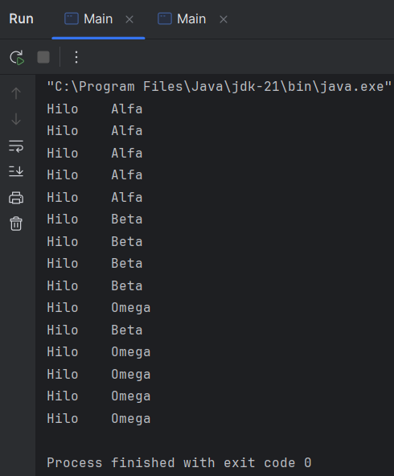

# EV1 - Examen 1 - Programación de Servicios y Procesos

En este README.md encontrarás una explicación general de cómo se han planteado los ejercicios de este examen.

El código ha sido extensamente comentado, por lo que es ideal echarle un vistazo para verlo en más profundidad.

## Explicación del ejercicio 1

En el primer ejercicio, he creado tres clases diferentes que implementaban la clase Thread (con su correspondiente método run()), creado un objeto (hilo) de cada una, almacenado todos en una colección y ejecutado cada uno de ellos usándola. Acabamos obteniendo un output intercalado.

### Resultado del ejercicio 1

## Explicación del ejercicio 2

El segundo ejercicio ha sido algo más complicado: hemos creado colecciones donde almacenar resultados, también 3 objetos de la clase Runnable que metían en su colección correspondiente un número entero al azar del 1 al 6 (), creado un ScheduledExecutorService que programaba a cada objeto que hacía de dado que se ejecutara según pasase un segundo, y por último, vuelto a programar al ScheduledExecutorService para que después de 5 segundos (o 5 resultados) detuviese la ejecución cada segundo de nuestros hilos/dados y nos imprimiese los resultados.

### Resultado del ejercicio 2

